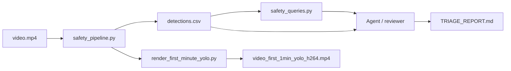

## SafetyVLM — AV Safety Event Triage Demo

### Overview

SafetyVLM is a small end-to-end demo for **autonomous vehicle (AV) safety event detection** on dashcam video:

- **Stage 1 — Perception:** YOLOv8 on `video.mp4` → `detections.csv` + printed safety flags.
- **Stage 2 — Analysis:** DuckDB SQL over `detections.csv` (`safety_queries.py`).
- **Stage 3 — Triage:** Cursor agent (or human reviewer) reads the CSV + query output → **`TRIAGE_REPORT.md`** with ranked events and reasoning.
- **Optional — Visualization:** first-minute YOLO overlay clip for demos.



### Repo layout

| Path | Role |
|------|------|
| `safety_pipeline.py` | YOLOv8 → `detections.csv` + console safety flags |
| `safety_queries.py` | DuckDB analysis over `detections.csv` |
| `TRIAGE_REPORT.md` | Agent/human triage report (committed) |
| `detections_sample.csv` | Small reproducible slice of detections (committed) |
| `render_first_minute_yolo.py` | Render first 60s with YOLO overlays |
| `vlm_triage.py` | *Legacy optional* — embedded Claude API triage |
| `HANDOFF.md` | Engineer handoff notes |
| `video.mp4` | Local input (gitignored) |
| `detections.csv` | Full run output (gitignored; regenerate locally) |

### Setup

```powershell
cd SafetyVLM
python -m venv .venv
.\.venv\Scripts\activate
python -m pip install -r requirements.txt
```

Place `video.mp4` in the project root (or edit `VIDEO_PATH` in `safety_pipeline.py`).

### Stage 1: run YOLO over video

```powershell
# Full video (~162k frames; long on CPU — use GPU if available)
Remove-Item Env:SAFETY_PIPELINE_MAX_FRAMES -ErrorAction SilentlyContinue
python safety_pipeline.py

# Partial run for iteration
$env:SAFETY_PIPELINE_MAX_FRAMES = "500"
python safety_pipeline.py
```

Outputs: `detections.csv` and a console summary (pedestrian+vehicle co-occurrence, low-confidence traffic lights, stop signs).

### Stage 2: offline safety queries

```powershell
python safety_queries.py
```

### Stage 3: agent triage → markdown report

After Stage 1 completes, ask your coding agent (e.g. Cursor):

> Read `detections.csv` and the output of `python safety_queries.py`. Write or update `TRIAGE_REPORT.md` with an executive summary, severity-ranked events (HIGH / MEDIUM / LOW), clustered time episodes, limitations, and interview talking points.

No API key required for the main workflow.

### YOLO visualization (first 60 seconds)

```powershell
python render_first_minute_yolo.py
```

Use `video_first_1min_yolo_h264.mp4` for broad player compatibility.

### Legacy: embedded VLM triage

`vlm_triage.py` optionally calls Anthropic Claude (`ANTHROPIC_API_KEY`) → `triage_results.csv`. Not required for the agent-based workflow.

### Interview talking points

- Explainable **rule-based funnel** before expensive review.
- **Separation of concerns:** detection → logging → SQL characterization → human/agent triage.
- **Known limits:** same-frame co-occurrence ≠ spatial proximity; no tracking; box counts ≠ unique objects.
- Extensions: IoU/proximity, temporal clustering, ByteTrack, dashboard timeline.
